# LapNest
A fully responsive E-commerce site for buying laptops made using node.js, MongoDB, Express, Socket.IO, Tailwind CSS, Ejs, JavaScript, Passport.js, Axios, SASS, Laravel-Mix. The user can look for laptops and add them to cart and buy them, all the communication is done in realtime.
   
   ## Requirements  
   "axios": "^0.20.0",
    "bcrypt": "^5.0.0",
    "connect-mongo": "^3.2.0",
    "dotenv": "^8.2.0",
    "ejs": "^3.1.5",
    "express": "^4.17.1",
    "express-ejs-layouts": "^2.5.0",
    "express-flash": "0.0.2",
    "express-session": "^1.17.1",
    "moment": "^2.29.1",
    "mongoose": "^5.10.9",
    "noty": "^3.2.0-beta",
    "passport": "^0.4.1",
    "passport-local": "^1.0.0",
    "socket.io": "^2.3.0",
    "cross-env": "^7.0.2",
    "laravel-mix": "^5.0.7",
    "nodemon": "^2.0.4",
    "resolve-url-loader": "^3.1.0",
    "sass": "^1.27.0",
    "sass-loader": "^8.0.2",
    "vue-template-compiler": "^2.6.12"
 
 ## Steps  
  Install all the requirements.  
  Import some of the data from the menu.json file.
  
   ## Screenshots  
   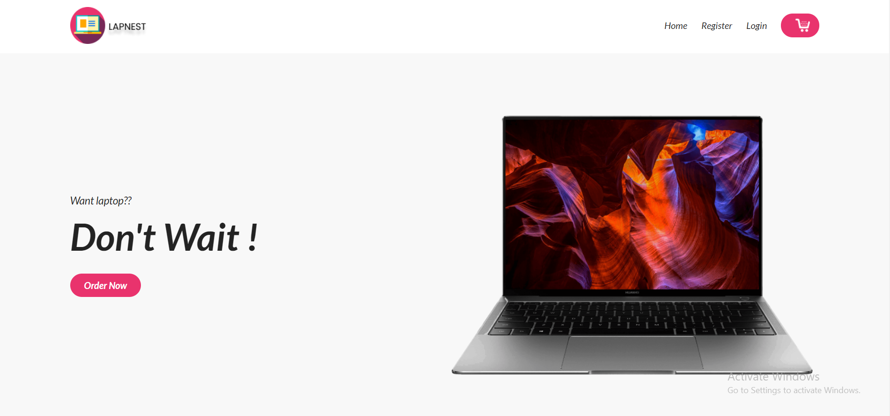  
   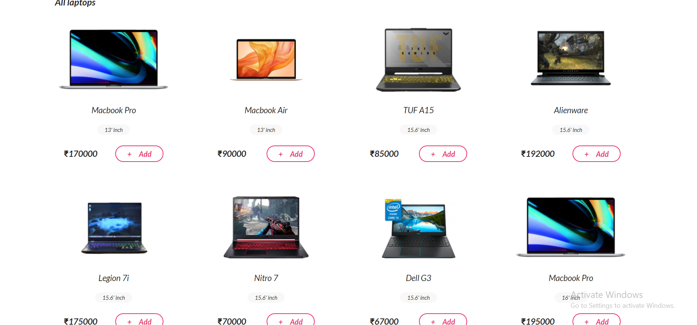  
   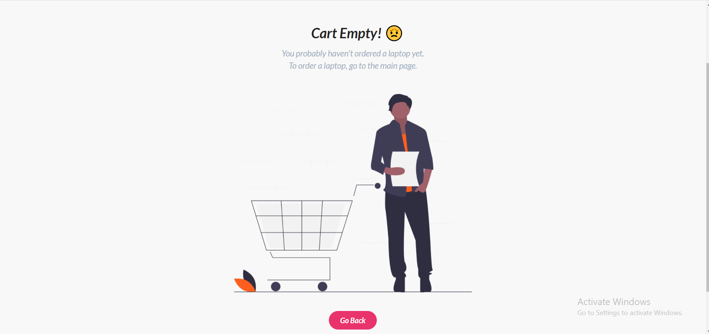  
   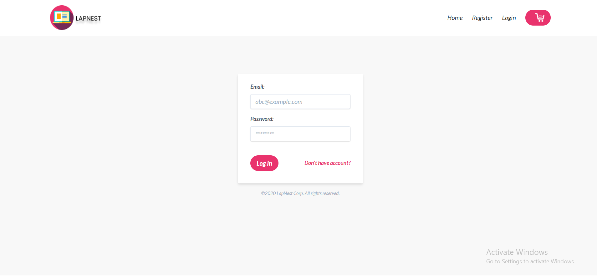  
   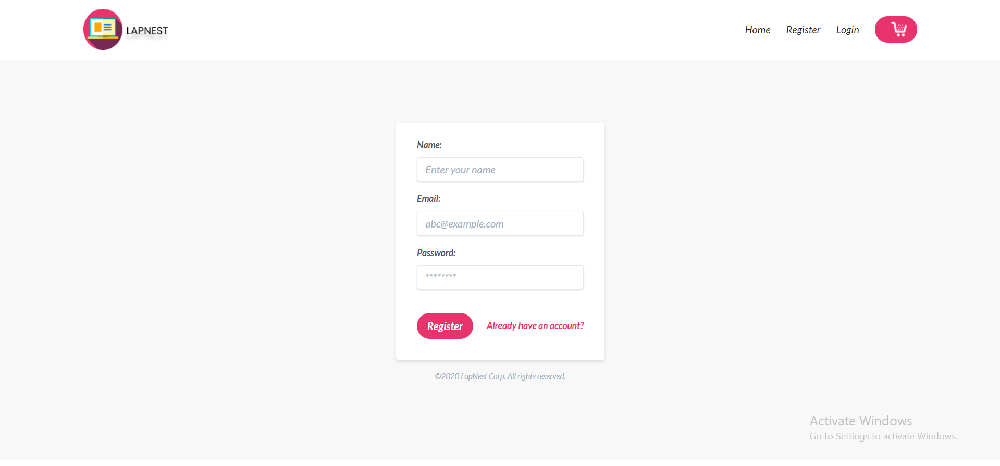
   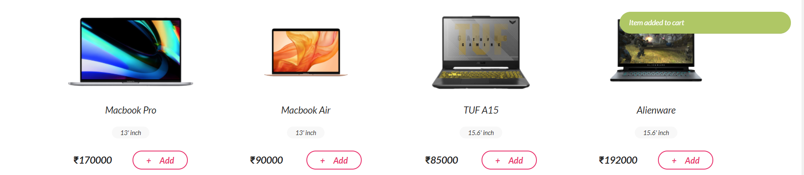
   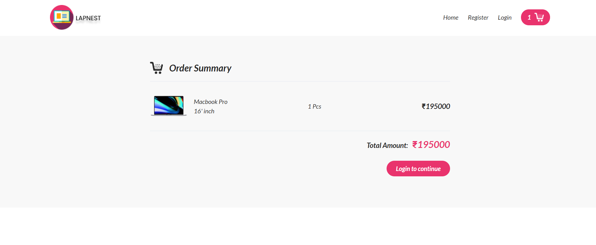
   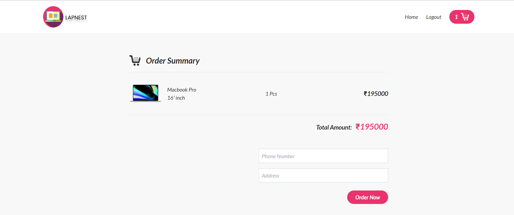
   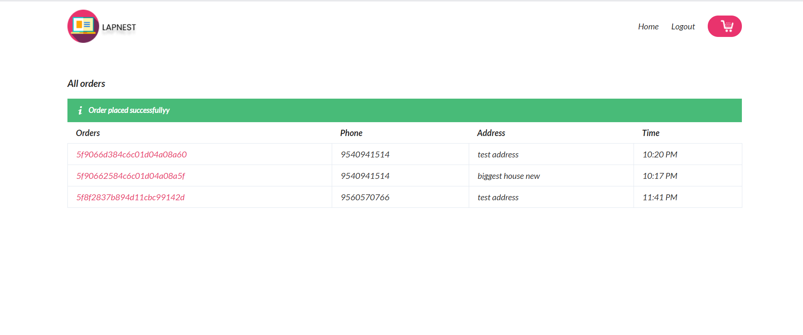
   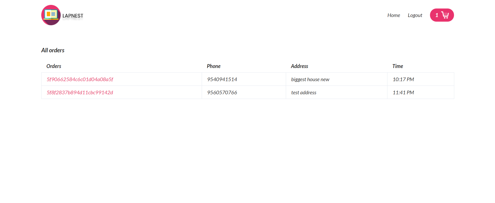
   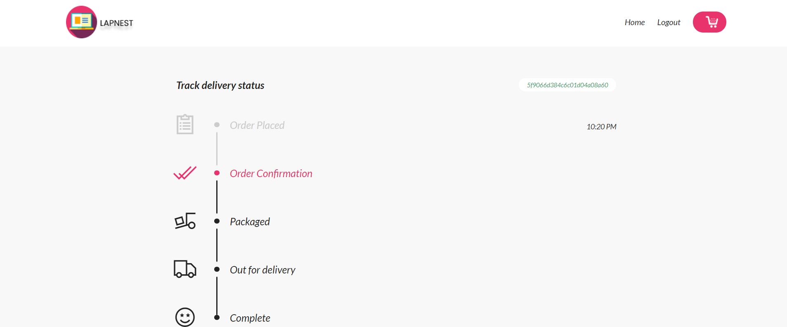
   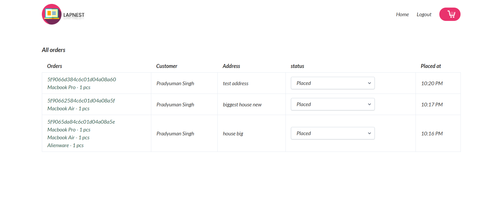
   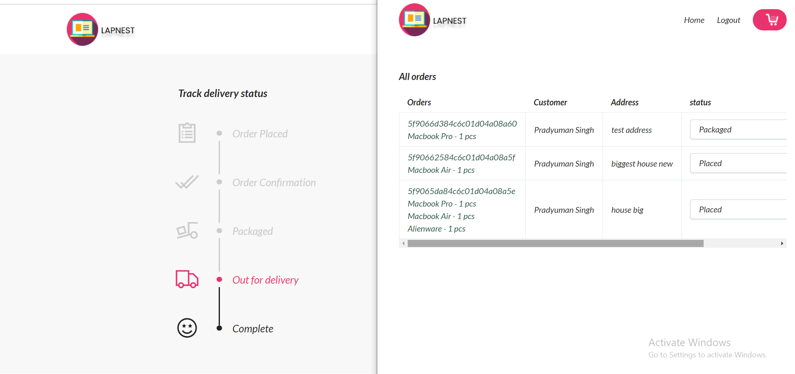
